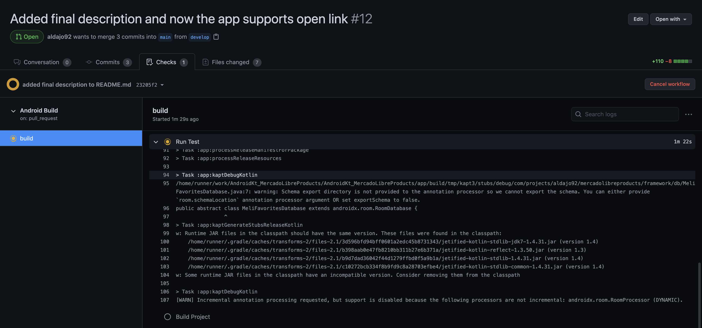

# MercadoLibre Products (Android app made in Kotlin) #

## Description

This app let to the user find products in MercadoLibre and store it in a local database, when it is marked as favorite. Supports all coutries available in MercadoLibre.

## Preview ##

## Main Features
- It has a search field to find products in Mercado Libre.
- App supports DarkMode
- User can mark favorite products to save it in a local database.
- Support live rotation without loosing data.
- Open product link to see in browser.

## General stack for this project: ##

- Dagger 2
- Navigation Components
- LiveData
- MVVM Architechture
- Room
- Retrofit
- Glide
- Coroutines

## Testing tools:

- Junit4
- Mockito

## Architecture implemented ##

For this project, a clean architecture was implemented based on the [Clean Architecture for Android](https://www.raywenderlich.com/3595916-clean-architecture-tutorial-for-android-getting-started) reference. This implementation considers different levels represented by the following diagram:

The "mercado-libre" app created, two modules are defined as follows:

- [core](/core): This module contains the domain and data layers, written purely in kotlin. These layers separated guarantee reused in other modules or projects without any dependency with the framework and upper layers.
  
- [app](/app): This module consumes the core module, using the corresponding android implementations, covering the framework and UI layers.

The interaction between each layer follows this diagram:

To guarantee the Dependency Inversion principle from SOLID, this project implements Dagger2 to delegate all of the injection operations.

## Navigation Graph ##

## PR validations with Github Actions ##
Check [android_build.yml](.github/workflows/android_build.yml) to get more information about the container and jobs configurations:

## References ##

RecyclerView:
- [RecyclerView 2020: a modern way of dealing with lists in Android using DataBinding](https://fraggjkee.medium.com/recyclerview-2020-a-modern-way-of-dealing-with-lists-in-android-using-databinding-d97abf5fb55f)
- [Getting screen width on API Level 30 (Android 11)](https://stackoverflow.com/questions/63407883/getting-screen-width-on-api-level-30-android-11-getdefaultdisplay-and-getme)
- [How to databinding image loading with Glide?](https://stackoverflow.com/questions/56889880/how-to-databinding-image-loading-with-glide)

Github Actions:
- [Setup CI For Android Apps Using GitHub Actions // Android CI Tutorial](https://www.youtube.com/watch?v=K9w01h4-Wnc)

Coroutines:
- [coroutines](https://developer.android.com/topic/libraries/architecture/coroutines)
- [Test utilities for kotlinx.coroutines.](https://kotlin.github.io/kotlinx.coroutines/kotlinx-coroutines-test/)
- [Kotlin coroutine unit test fails with “Module with the Main dispatcher had failed to initialize”](https://stackoverflow.com/questions/58303961/kotlin-coroutine-unit-test-fails-with-module-with-the-main-dispatcher-had-faile)
- [MVVM_coroutine](https://github.com/khambhaytajaydip/MVVM_coroutine)

Retrofit:
- [Using Retrofit with Kotlin Coroutines in Android](https://blog.mindorks.com/using-retrofit-with-kotlin-coroutines-in-android)
- [Android’s MVVM Architecture in Kotlin ft. Retrofit](https://medium.com/@umang.burman.micro/androids-mvvm-architecture-in-kotlin-ft-retrofit-6acc22cabfc6)
- [Kotlin Coroutines MVVM Retrofit UnitTestCases — Part3](https://b-chandrasaimohan.medium.com/kotlin-coroutines-mvvm-retrofit-unittestcases-part3-17a0652d638e)
- [Android's MVVM Architecture in Kotlin ft. Retrofit](https://github.com/umangburman/MVVM-Retrofit-Kotlin-Example)

Room:
- [Android Room with a View - Kotlin](https://developer.android.com/codelabs/android-room-with-a-view-kotlin)
- [Save data in a local database using Room](https://developer.android.com/training/data-storage/room)
- [Test and debug your database](https://developer.android.com/training/data-storage/room/testing-db)
- [Using and testing Room Kotlin APIs](https://medium.com/androiddevelopers/using-and-testing-room-kotlin-apis-4d69438f9334)
- [Room with Unit test in Kotlin](https://medium.com/@chandilsachin/room-with-unit-test-in-kotlin-4ad31a39a291)

Architechture:
- [Clean Architecture Tutorial for Android: Getting Started](https://www.raywenderlich.com/3595916-clean-architecture-tutorial-for-android-getting-started)
- [Injecting Android ViewModels With Dagger2 in a Clean Architecture](https://betterprogramming.pub/injecting-android-viewmodels-with-dagger2-in-clean-architecture-744c1fe81530)
- [Android Dagger 2 Injection For Fragment (Kotlin)](https://code.luasoftware.com/tutorials/android/dagger2-injection-for-fragment/)
- [Create a complete Android app from scratch ~ Retrofit - Dagger2 - Room - MVVM and LiveData](https://nsaveek.medium.com/create-a-complete-android-app-from-scratch-retrofit-dagger2-room-mvvm-and-livedata-92052987ff59)
- [The “Real” Repository Pattern in Android](https://proandroiddev.com/the-real-repository-pattern-in-android-efba8662b754)
- [Injecting ViewModel — hard to easy](https://medium.com/mobile-app-development-publication/injecting-viewmodel-from-hard-to-easy-c06c0fe1c8e9)
- [Android Kotlin Fundamentals:Repository](https://developer.android.com/codelabs/kotlin-android-training-repository)
- [Dagger 2 for Dummies in Kotlin — provides and module](https://medium.com/mobile-app-development-publication/dagger-2-for-dummies-in-kotlin-provides-and-module-b84dca1b0d03)
- [Android Architecture: MVVM with Coroutines + Retrofit + Hilt + Kotlin Flow + Room](https://narendrasinhdodiya.medium.com/android-architecture-mvvm-with-coroutines-retrofit-hilt-kotlin-flow-room-48e67ca3b2c8)

ViewModel:
- [Should I include LifecycleOwner in ViewModel?](https://stackoverflow.com/questions/48396092/should-i-include-lifecycleowner-in-viewmodel)
- [ViewModels: Persistence, onSaveInstanceState(), Restoring UI State and Loaders](https://medium.com/androiddevelopers/viewmodels-persistence-onsaveinstancestate-restoring-ui-state-and-loaders-fc7cc4a6c090)

Navigation:
- [Get started with the Navigation component](https://developer.android.com/guide/navigation/navigation-getting-started)
- [Pass data between destinations](https://developer.android.com/guide/navigation/navigation-pass-data)
- [Using Safe Args With the Android Navigation Component](https://www.raywenderlich.com/19327407-using-safe-args-with-the-android-navigation-component)
- [Beginner’s Guide to Bottom Navigation with Android Jetpack](https://medium.com/android-news/beginners-guide-to-bottom-navigation-with-android-jetpack-5485d2b8bbb5)
- [Navigation with ViewBinding](https://stackoverflow.com/questions/60733289/navigation-with-view-binding)
- [NavigationAdvancedSample](https://github.com/android/architecture-components-samples/tree/master/NavigationAdvancedSample)

Testing Frameworks:
- [How to mock final classes on Kotlin using Mockito 2 (KAD 23)](https://antonioleiva.com/mockito-2-kotlin/)
- [Mocking Coroutines](https://proandroiddev.com/mocking-coroutines-7024073a8c09)
- [How to verify a method is called two times with mockito verify](https://stackoverflow.com/questions/14889951/how-to-verify-a-method-is-called-two-times-with-mockito-verify)
- [Advanced Android in Kotlin 05.3: Survey of Testing Topics](https://developer.android.com/codelabs/advanced-android-kotlin-training-testing-survey)
- [Unit Testing for ViewModel](https://medium.com/mindorks/unit-testing-for-viewmodel-19f4d76b20d4)

Binding & Views:
- [Binding adapters](https://developer.android.com/topic/libraries/data-binding/binding-adapters)
- [Tutorial on Shared Element Transitions in Android Apps](https://rubygarage.org/blog/shared-element-transitions-in-android)
- [Shared Elements in Android Navigation Architecture Component](https://github.com/serbelga/android_navigation_shared_elements)
- [Pagination in RecyclerView in Android](https://androidwave.com/pagination-in-recyclerview/)
- [Transitions in Android Navigation Component](https://medium.com/@serbelga/shared-elements-in-android-navigation-architecture-component-bc5e7922ecdf)

## Author
Alejandro Daniel José Gómez Flórez (@aldajo92)
